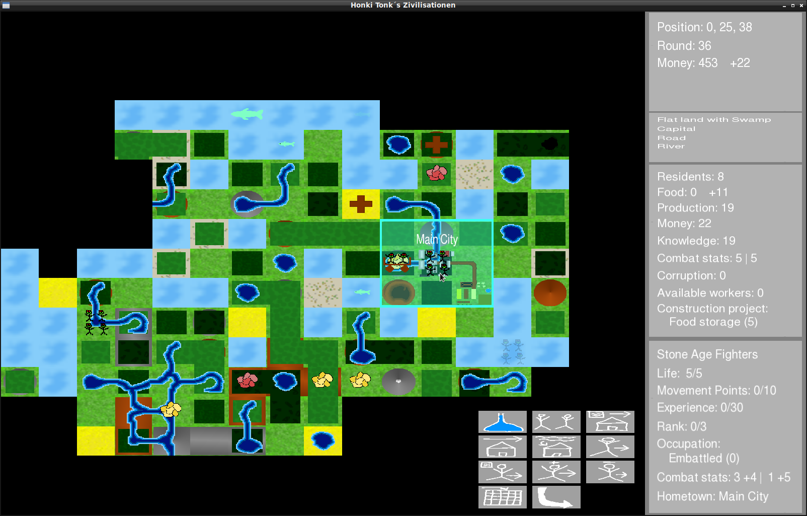
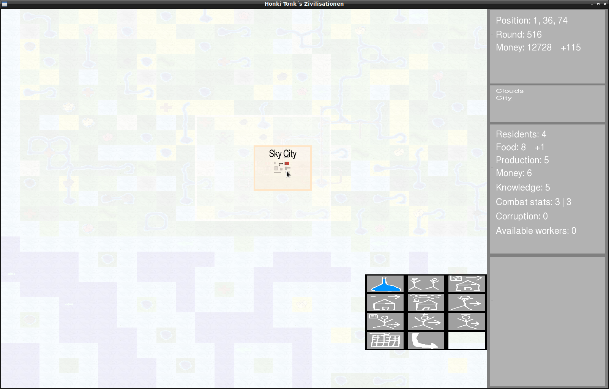
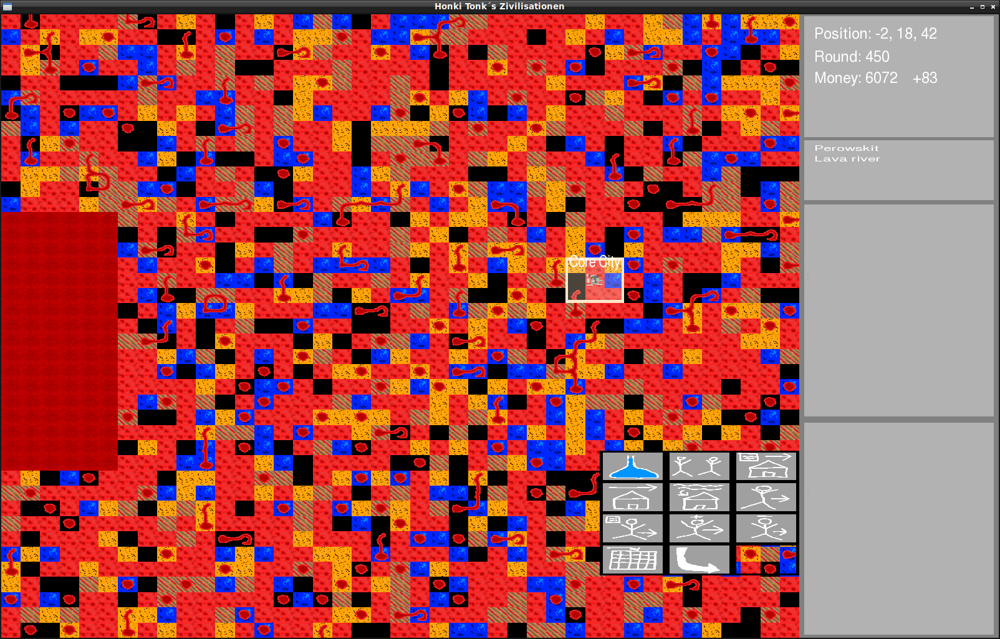
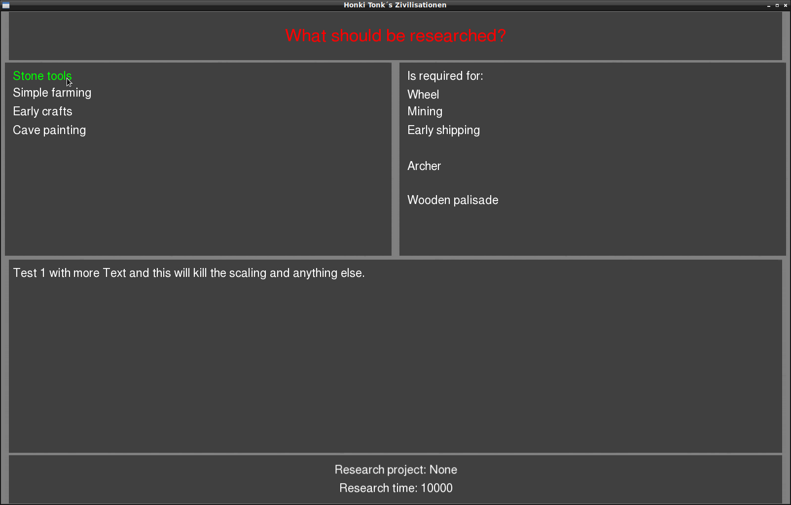
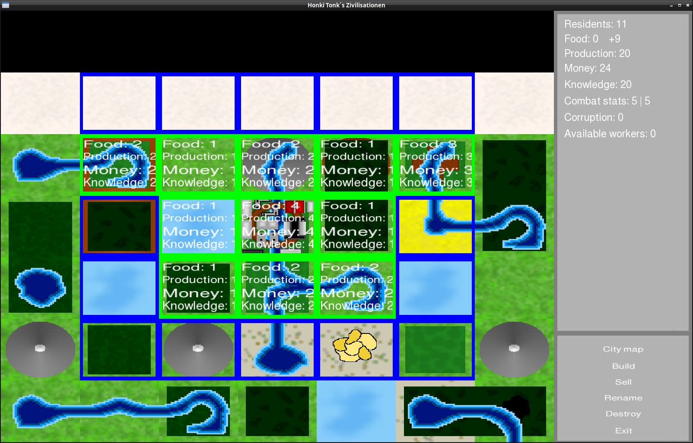
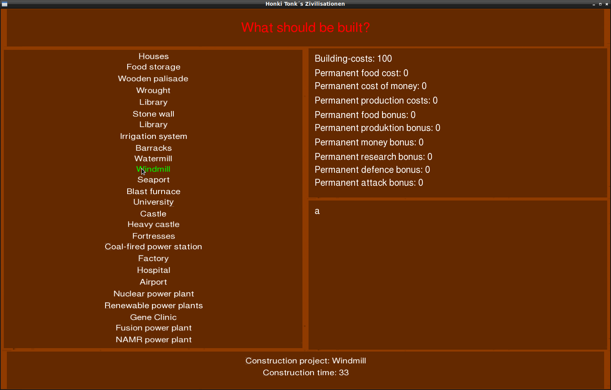
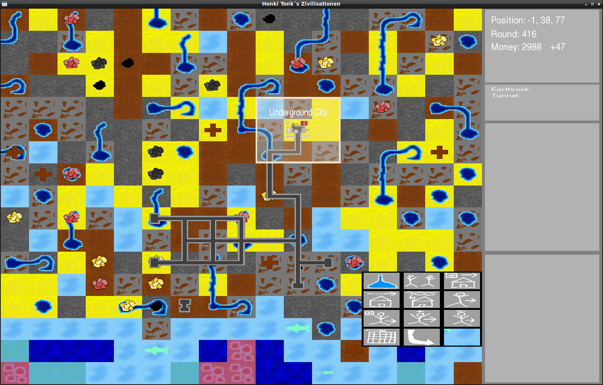

# Honki Tonk´s Zivilisationen - Version: 0.05.0510
Der Code meines 4X-Rundenstrategiespiels.
Geschrieben in Ada 2022 unter Verwendung der Ada Standardbibliothek, der [ASFML 2.5.3](https://github.com/mgrojo/ASFML), der [CSFML 2.5.1](https://github.com/SFML/CSFML) und der [SFML 2.5.1](https://github.com/SFML/SFML). Nur unter Linux intensiv getestet, sollte aber auch unter anderen Betriebssystemen problemlos funktionieren.

The Code of my 4X turn-based strategy game.
Written in Ada 2022 using the Ada standard library, the [ASFML 2.5.3](https://github.com/mgrojo/ASFML), the [CSFML 2.5.1](https://github.com/SFML/CSFML) and the [SFML 2.5.1](https://github.com/SFML/SFML). Only intensively tested under Linux, but should also work without problems under other operating systems.

Mich unterstützen/Support me:

[YouTube](https://www.youtube.com/user/tpHonkiTonk), [Twitch](https://www.twitch.tv/tphonkitonk), [PayPal](https://www.paypal.com/paypalme/tpHonkiTonk), [Patreon](https://www.patreon.com/HonkiTonk), [Tipeee](https://www.tipeeestream.com/tphonkitonk/donation), [Amazon](https://www.amazon.de/registry/wishlist/2DNQHH9AI6JGR), [Steam](https://steamcommunity.com/profiles/76561197989126693/wishlist)

Bilder/Pictures:

